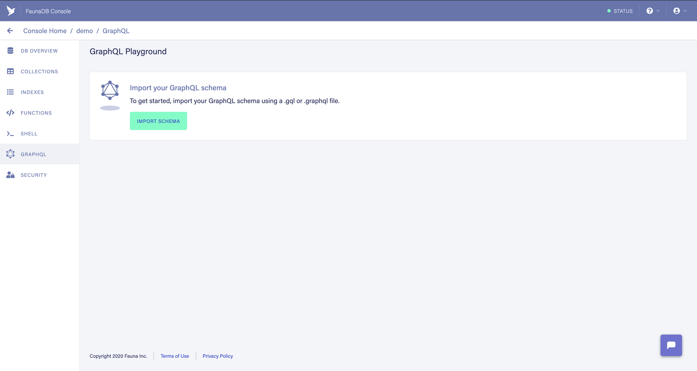

Getting started with databases and GraphQL has really never been easier. Previously I've gone through [Wes Bos's Advanced React and GraphQL course](https://advancedreact.com/) and it was _great_ despite the fact that I was not able to apply the backend knowledge professionally. My background is with more of the traditional relational databases such as Microsoft SQL and Oracle SQL on top of others like MySQL and MariaDB, and since I've only dabbled with MongoDB Atlas I decided to give another NoSQL database a try. Ultimately I ended up with [FaunaDB](https://fauna.com/), but it's not quite a NoSQL database, it's something... nicer.

## FaunaDB

> The database built for serverless, featuring native GraphQL

Honestly that tagline nailed it for me. We're looking to use GraphQL and don't want to host a database or a server, whether that be a droplet I have to manage or a container I have to maintain an image for. We want to focus on code.

Do you remember Wes Bos's course? If not, we used an Express GraphQL server with [GraphQL Yoga](https://github.com/prisma-labs/graphql-yoga) and [Prisma](https://www.prisma.io/) to build our schema with fancy mutations, resolvers, and the like. Although it was fun to see some of the grit, running my own server somewhere wasn't ideal. Fauna fills this role as our _serverless_ database provider, which means we only have to [call on it](https://www.youtube.com/watch?v=3p60xYFuAnY).

Let's take a stroll setting up a database with FaunaDB, writing and importing that schema into the new database, and taking a look at the GraphQL endpoint to see how we can call the queries and mutations generated by Fauna.

To get started, go ahead and [sign up for a Fauna account](https://dashboard.fauna.com/accounts/register).

## GraphQL

For this demo we are going to take a look at setting up a generic schema for _users_ of an application. Create a new project directory and let's create our GraphQL schema file:

```graphql
# /schema.graphql
# create an object to store user data
type User {
  # property `name` will be a String
  name: String!
}

# create queries to search for all users
#   and for user by name
type Query {
  allUsers: [Player]!
  user(name: String): User
}
```

After taking the tour of FaunaDB, head on over to create a new database - `demo` - and import the new GraphQL schema to our Fauna database.


Once Fauna is done importing the schema use the playground to poke around at what has been generated for us to consume like `createUser`. All of our CRUD operations have been generated for us, and all we have to do is perform operations via GraphQL qeuries and mutations.

When the playground loads you'll notice it's pointing to `https://graphql.fauna.com/graphql` and has a header with Basic authentication, which is a base64 encoded string of `username:password`. It's good to know that it is authenticated, however we don't want to use our Fauna credentials to access so we'll need a token.

Head on over to the "Security" tab.



Give it a name like "serverless-demo" or something that makes sense to you, then hold on to that key. Create a new file, `.env`:

```text
DB_TOKEN=<fauna-security-token>
```

Perfect. Let's head on over to set up our serverless project with ZEIT Now.

## ZEIT Now

In our project directory, create a new ZEIT Now project:

```shell
now
```

Follow the prompts and continue on through accepting the defaults or changing the name. Create a new directory named `api`, after it should look something like:

```
| my-new-serverless-project
  |- api/
  |- schema.graphql
  |- .env
```
